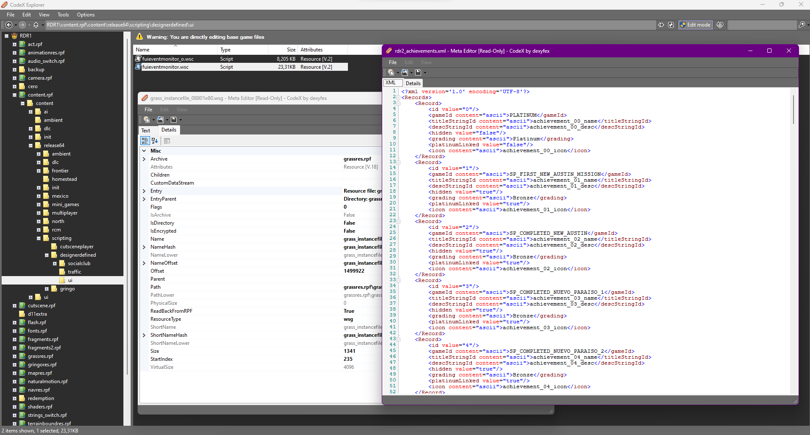
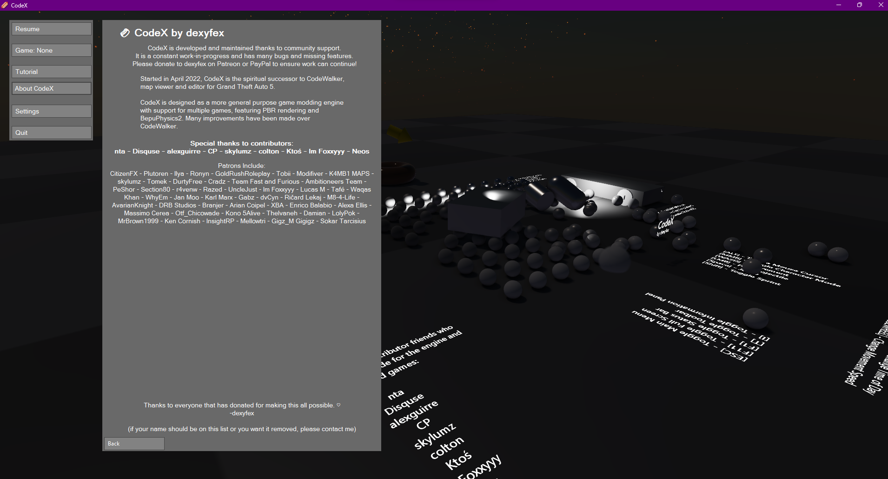
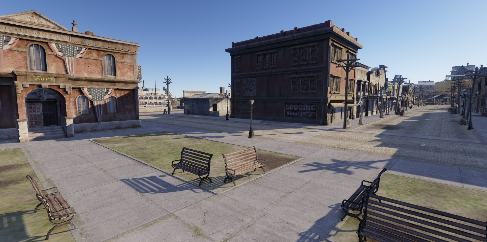
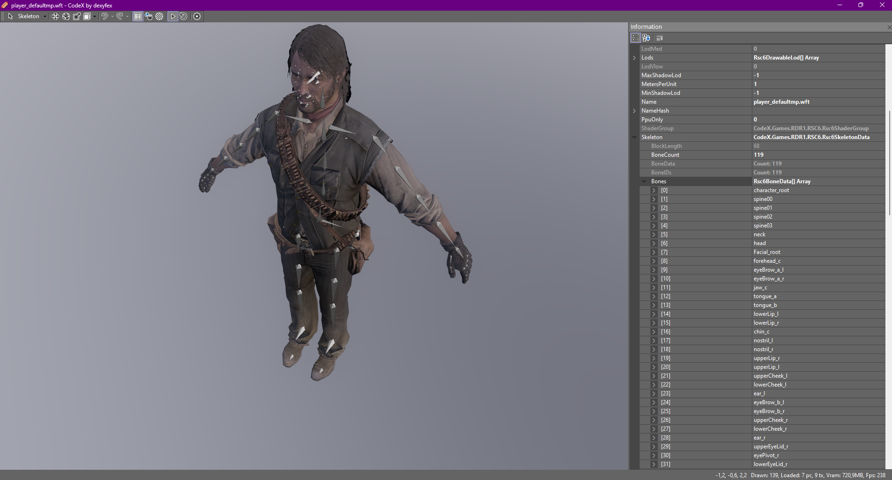
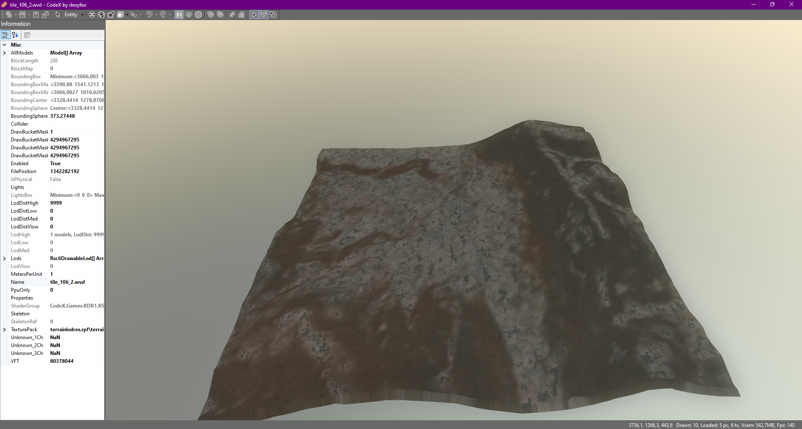

# CodeX (023)

Implementation of Red Dead Redemption into CodeX for Nintendo Switch (and potentially PS4/PS5)

--------------------

You will need the main engine to either run it or compile the source.        
Other games are also supported to some extent (RDR2/GTAIV/GTAV/MP3/etc) with RDR2 being the main project.

--------------------

Both the main engine and additional game support are available if you subscribe to [@dexyfex](https://www.patreon.com/dexyfex)         
For more information, you can also visit the [CodeWalker discord](https://discord.gg/rgU4SbeR)                
To set up, simply place my .dll/.pdb/.strings files from the bin/Debug/net7.0 folder into the CodeX and CodeX Explorer folders.

Please note that everything is a work in progress, including the separated engine. If you're new and plan to mod the game, you might prefer using a more stable RPF tool for RDR1.

--------------------

If you wish to contribute to this project and the code, feel free to message me on my Discord #imfoxxyyy :-)

# Contributors
dexyfex     
nta      
Disquse       
alexguirre      
CP      
skylumz      
colton      
Ktoś      
Im Foxxyyy      
Neos    

# Random screenshots

