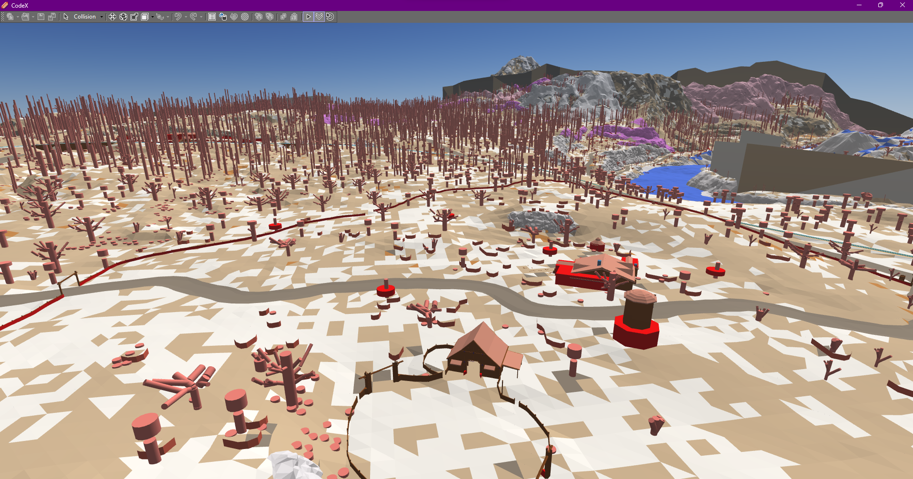

# CodeX (026)

CodeX implementation for Red Dead Redemption on Nintendo Switch (and potentially PS4/PS5)

--------------------

You need the main CodeX engine to either run this or compile the source.     
More info here : [@dexyfex](https://www.patreon.com/dexyfex) and [CodeWalker discord](https://discord.gg/rgU4SbeR)   

--------------------             

After that, [download the files](https://github.com/Foxxyyy/CodeX.Games.RDR1/releases/latest) and paste them to the CodeX/Explorer folders, next to the executable.           

# Udpates

I make regular updates to this project when I have some spare time, so it will or will not work with older versions of CodeX.              
I also work on an [RDR1 Sollumz fork](https://github.com/Foxxyyy/SollumzRDR), for now you can import `WFD & WVD` files.                       

# CodeX Contributors
* dexyfex     
* nta      
* Disquse       
* alexguirre      
* CP      
* skylumz      
* colton      
* Ktoś      
* Mars (Im Foxxyyy)      
* Neos
* Western

# Credits for this project
* Mars (Im Foxxyyy)                              
* dexyfex                                   
* revelations                              
* Disquse                                           
* LennyH (BadassBaboon)                                     
* CabooseSayzWTF                                      

# Random Pictures

